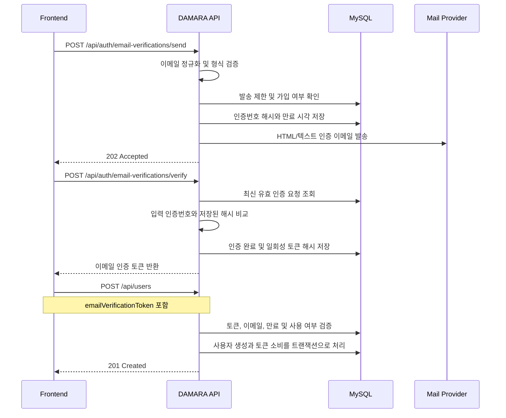

# 회원가입 이메일 인증 기능 기획서

## 1. 문서 정보

```text
작성일: 2026-07-23
수정일: 2026-07-24
문서 상태: 로컬 구현 완료
대상 프로젝트: damara-BE
대상 기능: 로컬 회원가입 이메일 인증
제외 범위: 카카오 OAuth 회원가입
```

이 문서는 회원가입 전에 사용자가 입력한 이메일로 인증번호를 발송하고, 인증을 완료한 이메일만 회원가입에 사용할 수 있도록 하는 기능의 정책과 구현 범위를 정의한다.

---

## 2. 목표

현재 회원가입 API는 이메일 주소의 형식과 중복 여부를 확인하지만, 사용자가 해당 이메일을 실제로 사용할 수 있는지는 확인하지 않는다.

이 기능은 다음 흐름으로 이메일 소유 여부를 확인한다.

```text
이메일 입력
→ 인증번호 발송
→ 인증번호 확인
→ 일회성 이메일 인증 토큰 발급
→ 인증 토큰을 포함해 회원가입
→ 사용자 생성과 동시에 인증 토큰 소비
```

이메일은 앞뒤 공백을 제거하고 소문자로 정규화한 뒤 정확히 `@mju.ac.kr`로 끝나는지 확인한다. 인증번호 발송, 인증번호 확인, 회원가입 요청에서 모두 동일한 규칙을 적용하며 비명지대 이메일은 메일 발송 전에 거부한다.

---

## 3. 인증번호 정책

| 항목 | 정책 |
|---|---|
| 인증번호 | 암호학적으로 안전하게 생성한 6자리 숫자 |
| 인증번호 유효시간 | 발송 시점부터 5분 |
| 재발송 대기시간 | 60초 |
| 이메일별 발송 제한 | 1시간에 최대 5회 |
| IP별 발송 제한 | 1시간에 최대 20회 |
| 인증번호 입력 제한 | 한 인증 요청당 최대 5회 |
| 인증 완료 토큰 유효시간 | 발급 시점부터 15분 |
| 인증번호 저장 | 원문 대신 HMAC 또는 안전한 해시 값 저장 |
| 인증번호 로그 출력 | 금지 |
| 인증번호 재사용 | 인증 성공 또는 재발송 이후 금지 |
| 인증 완료 토큰 재사용 | 회원가입 성공 이후 금지 |

재발송에 성공하면 이전 인증번호는 즉시 무효화한다. 인증번호가 만료되거나 입력 횟수를 초과하면 새 인증번호를 발급받아야 한다.

### 3.1 인증 이메일 제목

```text
[DAMARA] 회원가입 이메일 인증번호를 확인해 주세요
```

### 3.2 발신 정보

```text
표시 이름: DAMARA
발신 주소: 환경 변수 MAIL_FROM에 설정한 발신 전용 주소
회신 주소: 회신을 처리하지 않는 경우 Reply-To를 설정하지 않거나 안내용 주소 사용
문자 인코딩: UTF-8
```

발신 주소는 운영 환경에서 SPF, DKIM, DMARC 설정이 완료된 주소를 사용한다. 제목과 표시 이름은 사용자가 발신자를 쉽게 식별할 수 있도록 모든 환경에서 같은 형식을 유지한다.

### 3.3 HTML 이메일 양식

```html
<!doctype html>
<html lang="ko">
  <head>
    <meta charset="utf-8" />
    <meta name="viewport" content="width=device-width, initial-scale=1" />
    <title>DAMARA 회원가입 이메일 인증</title>
  </head>
  <body style="margin:0;padding:0;background:#f5f6f8;font-family:Arial,'Apple SD Gothic Neo','Noto Sans KR',sans-serif;color:#202124;">
    <table role="presentation" width="100%" cellspacing="0" cellpadding="0" style="background:#f5f6f8;padding:32px 16px;">
      <tr>
        <td align="center">
          <table role="presentation" width="100%" cellspacing="0" cellpadding="0" style="max-width:560px;background:#ffffff;border-radius:12px;padding:40px 32px;">
            <tr>
              <td>
                <p style="margin:0 0 24px;font-size:20px;font-weight:700;">DAMARA</p>
                <h1 style="margin:0 0 16px;font-size:24px;line-height:1.4;">회원가입 이메일 인증</h1>
                <p style="margin:0 0 24px;font-size:15px;line-height:1.7;">
                  DAMARA 회원가입을 위한 인증번호입니다.<br />
                  아래 인증번호를 인증 화면에 입력해 주세요.
                </p>
                <div style="margin:0 0 24px;padding:20px;text-align:center;background:#f1f3f5;border-radius:8px;font-size:32px;font-weight:700;letter-spacing:8px;">
                  {{verificationCode}}
                </div>
                <p style="margin:0 0 8px;font-size:14px;line-height:1.6;">
                  인증번호는 발송 후 <strong>{{expiresInMinutes}}분</strong> 동안 유효합니다.
                </p>
                <p style="margin:0;font-size:13px;line-height:1.6;color:#666666;">
                  본인이 요청하지 않았다면 이 이메일을 무시해 주세요.
                  인증번호는 다른 사람에게 공유하지 마세요.
                </p>
              </td>
            </tr>
          </table>
        </td>
      </tr>
    </table>
  </body>
</html>
```

### 3.4 텍스트 이메일 양식

HTML을 표시하지 못하는 메일 클라이언트를 위해 같은 내용의 텍스트 본문을 함께 보낸다.

```text
DAMARA 회원가입 이메일 인증

DAMARA 회원가입을 위한 인증번호입니다.
아래 인증번호를 인증 화면에 입력해 주세요.

인증번호: {{verificationCode}}

인증번호는 발송 후 {{expiresInMinutes}}분 동안 유효합니다.

본인이 요청하지 않았다면 이 이메일을 무시해 주세요.
인증번호는 다른 사람에게 공유하지 마세요.
```

### 3.5 템플릿 변수와 작성 기준

| 변수 | 설명 | 예시 |
|---|---|---|
| `{{verificationCode}}` | 발송 요청에 대해 생성한 6자리 인증번호 | `381204` |
| `{{expiresInMinutes}}` | 인증번호 유효시간(분) | `5` |

- 인증번호는 본문에서 가장 눈에 띄는 요소로 표시하되 이미지에만 넣지 않는다.
- 인증번호를 URL이나 회원가입 완료 링크에 포함하지 않는다.
- 사용자 이름처럼 검증되지 않은 값을 제목이나 본문에 삽입하지 않는다.
- HTML과 텍스트 본문의 인증번호 및 유효시간은 반드시 같아야 한다.
- 메일 발송 요청 ID 같은 내부 식별자와 서버 정보는 본문에 노출하지 않는다.
- 템플릿 렌더링 실패나 필수 변수 누락 시 이메일을 발송하지 않고 실패로 처리한다.

---

## 4. 사용자 흐름



메일 전송에 실패하면 해당 인증 요청을 사용할 수 없도록 무효화한다. 이미 가입된 이메일에 대한 응답은 계정 존재 여부 노출을 줄이기 위해 일반 발송 요청과 같은 `202 Accepted` 응답을 반환하되 실제 메일은 발송하지 않는 방식을 권장한다.

---

## 5. API 설계

### 5.1 인증번호 발송

```http
POST /api/auth/email-verifications/send
Content-Type: application/json
```

요청:

```json
{
  "email": "student@mju.ac.kr"
}
```

성공:

```http
202 Accepted
```

```json
{
  "message": "VERIFICATION_EMAIL_SENT",
  "expiresInSeconds": 300,
  "resendAfterSeconds": 60
}
```

예상 오류:

| HTTP | 오류 코드 | 조건 |
|---|---|---|
| 400 | `VALIDATION_ERROR` 또는 `INVALID_MJU_EMAIL` | 이메일 형식 오류 또는 `@mju.ac.kr` 이외 도메인 |
| 429 | `EMAIL_VERIFICATION_RATE_LIMITED` | 재발송 또는 발송량 제한 |
| 502 | `EMAIL_DELIVERY_FAILED` | 메일 제공자 전송 실패 |

### 5.2 인증번호 확인

```http
POST /api/auth/email-verifications/verify
Content-Type: application/json
```

요청:

```json
{
  "email": "student@mju.ac.kr",
  "code": "381204"
}
```

성공:

```http
200 OK
```

```json
{
  "verified": true,
  "emailVerificationToken": "opaque-one-time-token",
  "expiresInSeconds": 900
}
```

예상 오류:

| HTTP | 오류 코드 | 조건 |
|---|---|---|
| 400 | `VALIDATION_ERROR` 또는 `INVALID_MJU_EMAIL` | 이메일/인증번호 형식 오류 또는 `@mju.ac.kr` 이외 도메인 |
| 400 | `EMAIL_VERIFICATION_FAILED` | 인증번호 불일치 또는 유효한 요청 없음 |
| 410 | `VERIFICATION_CODE_EXPIRED` | 인증번호 만료 |
| 423 | `VERIFICATION_ATTEMPTS_EXCEEDED` | 최대 입력 횟수 초과 |

### 5.3 회원가입 요청 변경

회원가입 요청의 `user` 객체에 인증 완료 후 받은 토큰을 추가한다.

```json
{
  "user": {
    "email": "student@mju.ac.kr",
    "passwordHash": "password123",
    "nickname": "다마라",
    "emailVerificationToken": "opaque-one-time-token"
  }
}
```

추가 오류:

| HTTP | 오류 코드 | 조건 |
|---|---|---|
| 401 | `EMAIL_VERIFICATION_REQUIRED` | 인증 토큰 누락 |
| 401 | `INVALID_EMAIL_VERIFICATION_TOKEN` | 토큰 불일치 또는 변조 |
| 400 | `VALIDATION_ERROR` 또는 `INVALID_MJU_EMAIL` | `@mju.ac.kr` 이외 이메일로 회원가입 요청 |
| 410 | `EMAIL_VERIFICATION_EXPIRED` | 인증 토큰 만료 |
| 409 | `EMAIL_ALREADY_EXISTS` | 이미 가입된 이메일 |

인증 토큰에 연결된 이메일과 회원가입 요청 이메일이 같아야 한다. 사용자 생성과 토큰 소비는 하나의 트랜잭션으로 처리한다.

---

## 6. 데이터 설계

권장 테이블명은 `email_verifications`이다.

| 컬럼 | 타입 | Null | 설명 |
|---|---|---:|---|
| `id` | UUID | N | 인증 요청 ID |
| `email` | VARCHAR(255) | N | 정규화한 이메일 |
| `purpose` | VARCHAR(30) | N | 인증 목적, 초기 값 `signup` |
| `code_hash` | VARCHAR(255) | N | 인증번호 해시 |
| `token_hash` | VARCHAR(255) | Y | 인증 완료 토큰 해시 |
| `attempt_count` | INTEGER | N | 인증 실패 횟수, 기본값 0 |
| `max_attempts` | INTEGER | N | 최대 인증 시도 횟수, 기본값 5 |
| `expires_at` | DATETIME | N | 인증번호 만료 시각 |
| `verified_at` | DATETIME | Y | 인증 성공 시각 |
| `token_expires_at` | DATETIME | Y | 인증 완료 토큰 만료 시각 |
| `consumed_at` | DATETIME | Y | 회원가입으로 토큰을 소비한 시각 |
| `invalidated_at` | DATETIME | Y | 재발송 등으로 무효화한 시각 |
| `request_ip_hash` | VARCHAR(255) | Y | 발송 제한용 IP 해시 |
| `created_at` | DATETIME | N | 생성 시각 |
| `updated_at` | DATETIME | N | 수정 시각 |

권장 인덱스:

```text
INDEX(email, purpose, created_at)
UNIQUE(token_hash)
INDEX(expires_at)
INDEX(request_ip_hash, created_at)
```

만료·소비·무효화된 인증 요청은 운영 보존 정책에 따라 7~30일 후 배치 삭제한다.

---

## 7. 구현 범위

예상 변경 위치:

```text
src/models/EmailVerification.ts
src/repos/EmailVerificationRepo.ts
src/services/EmailVerificationService.ts
src/services/UserService.ts
src/controllers/email-verification.controller.ts
src/routes/email-verifications/EmailVerificationRoutes.ts
src/routes/common/validation/email-verification-schemas.ts
src/routes/common/validation/user-schemas.ts
src/common/mail/EmailSender.ts
src/common/mail/templates/signup-verification.ts
src/common/constants/ENV.ts
src/config/swagger.ts
src/app.ts
```

메일 전송 계층은 제공자에 종속되지 않는 `EmailSender` 인터페이스로 분리한다. 테스트에서는 가짜 구현을 주입해 제목, 수신자, HTML 본문, 텍스트 본문과 템플릿 변수를 검증한다.

필요한 환경 변수:

```text
MAIL_PROVIDER=smtp
MAIL_FROM=no-reply@example.com
SMTP_HOST=
SMTP_PORT=587
SMTP_SECURE=false
SMTP_USER=
SMTP_PASSWORD=
EMAIL_VERIFICATION_CODE_TTL_SECONDS=300
EMAIL_VERIFICATION_TOKEN_TTL_SECONDS=900
EMAIL_VERIFICATION_RESEND_SECONDS=60
EMAIL_VERIFICATION_MAX_ATTEMPTS=5
EMAIL_VERIFICATION_MAX_SENDS_PER_HOUR=5
EMAIL_VERIFICATION_MAX_IP_SENDS_PER_HOUR=20
EMAIL_VERIFICATION_REQUIRED=true
EMAIL_VERIFICATION_HMAC_SECRET=
```

구현 시 로컬·테스트 환경에서 외부 SMTP 없이 검증할 수 있도록 `MAIL_PROVIDER=json` 전송 방식도 함께 제공한다. 운영 환경에서는 `MAIL_PROVIDER=smtp`를 사용하며 필수 메일 설정이 없으면 서버 시작을 중단한다.

비밀 값은 저장소와 로그에 포함하지 않는다. 운영 시작 시 필수 환경 변수가 없으면 서버가 즉시 실패하도록 검증한다.

---

## 8. 보안 및 운영 요구사항

- 인증번호, 인증 토큰, 비밀번호, SMTP 비밀번호를 요청·응답 로그에서 마스킹한다.
- 짧은 인증번호 공간에 단순 SHA-256만 사용하지 않고 서버 비밀 키를 사용하는 HMAC 또는 적절한 해시를 사용한다.
- 인증번호와 토큰 비교는 가능한 경우 timing-safe 방식으로 수행한다.
- 여러 서버 인스턴스에서 동일하게 제한되도록 발송량과 인증 시도 횟수를 공유 저장소에서 관리한다.
- 이메일 제공자의 응답 본문에 민감 정보가 포함될 수 있으므로 그대로 로그에 남기지 않는다.
- 발송 성공은 제공자가 요청을 수락했다는 의미이며 최종 수신을 보장하지 않는다는 점을 운영 지표에 반영한다.
- 발송 요청 수, 제공자 실패율, 인증 성공률, 만료율, 제한 초과 횟수를 모니터링한다.

---

## 9. 테스트 계획

### 9.1 인증 정책

- 6자리 숫자 인증번호 생성
- 인증번호 원문이 DB와 로그에 남지 않음
- 정상 인증, 잘못된 인증번호, 만료, 최대 시도 초과
- 재발송 시 이전 인증번호 무효화
- 이메일별·IP별 발송 제한
- 인증 성공 시 15분짜리 일회성 토큰 발급
- 토큰 만료, 변조, 이메일 불일치, 재사용 거부
- 사용자 생성 실패 시 토큰이 소비되지 않음
- 동시 회원가입 요청 중 하나만 토큰 소비에 성공

### 9.2 이메일 내용

- 제목이 정책과 일치함
- 발신 표시 이름과 발신 주소가 설정값과 일치함
- HTML과 텍스트 본문을 모두 생성함
- 두 본문에 같은 인증번호와 유효시간이 들어감
- 인증번호가 HTML의 이미지나 링크에만 의존하지 않음
- 본인이 요청하지 않은 경우의 안내와 공유 금지 문구가 포함됨
- 템플릿 변수가 누락되면 발송하지 않음
- 한글, 숫자, 줄바꿈이 UTF-8로 정상 표시됨
- 주요 데스크톱·모바일 메일 클라이언트에서 레이아웃이 읽기 쉽게 표시됨

### 9.3 API 통합

- 인증번호 발송 API가 `202 Accepted`를 반환함
- 메일 제공자 실패 시 요청이 무효화되고 `502`를 반환함
- 인증 완료 토큰 없이 회원가입할 수 없음
- 인증한 이메일과 다른 이메일로 회원가입할 수 없음
- 회원가입 성공 후 동일 토큰을 다시 사용할 수 없음
- 기존 로그인과 카카오 OAuth 흐름에 회귀가 없음

---

## 10. 배포 체크리스트

- [ ] 운영 발신 계정과 `MAIL_FROM` 등록
- [ ] SPF, DKIM, DMARC 설정 확인
- [ ] 실제 메일 수신과 스팸 분류 여부 확인
- [ ] HTML/텍스트 본문 렌더링 확인
- [ ] 운영 SMTP 또는 메일 API 비밀 값 등록
- [ ] 인증용 HMAC 비밀 값 등록
- [ ] DB 마이그레이션 백업 및 적용
- [ ] 이메일·IP 발송 제한 설정 확인
- [ ] 민감 정보 로그 마스킹 확인
- [ ] 인증 API와 회원가입 변경 사항을 Swagger/OpenAPI에 반영
- [ ] 프론트엔드 인증 UI와 배포 순서 조율

구현 후 최소 다음 명령을 실행한다.

```bash
npm run type-check
npm test
npm run lint
npm run build
npm run openapi:lint
```

---

## 11. 완료 조건

- 사용자가 수신한 6자리 인증번호로 이메일 인증을 완료할 수 있다.
- 인증번호 발송 메일이 정의된 제목, 발신 정보, HTML 본문, 텍스트 본문을 사용한다.
- 유효한 일회성 인증 토큰이 없으면 로컬 회원가입을 완료할 수 없다.
- 인증번호와 인증 토큰의 만료, 재발송, 입력 제한, 재사용 방지가 동작한다.
- 인증번호와 토큰 원문이 DB와 로그에 남지 않는다.
- 사용자 생성과 인증 토큰 소비가 원자적으로 처리된다.
- Swagger, OpenAPI, ERD와 관련 변경 이력이 실제 구현과 일치한다.
- 단위·통합·회귀 테스트와 빌드가 통과한다.
