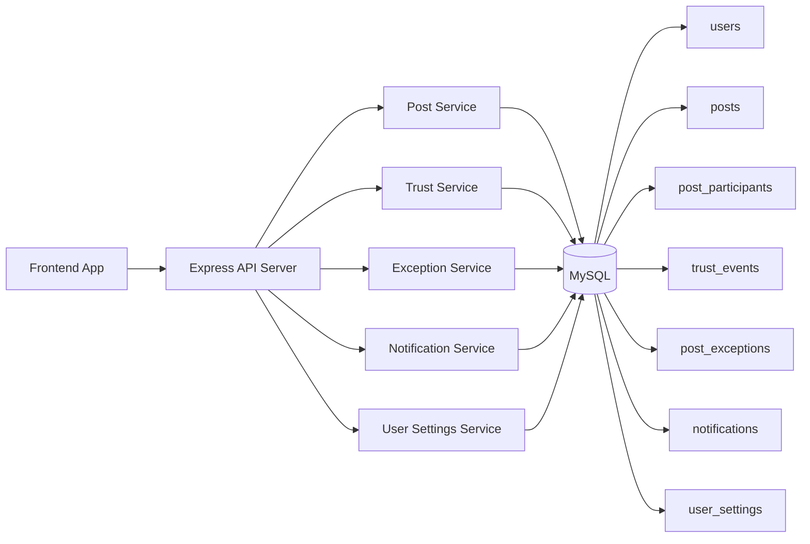

# DAMARA 특허 검토 자료

> 변리사 상담 전에 DAMARA의 기술 포인트를 정리한 내부 자료다. 실제 청구항과 출원 범위는 선행기술 조사 후 조정한다.

## 작성/검토 정보

| 항목 | 내용 |
| --- | --- |
| 프로젝트명 | DAMARA |
| 팀명 | The Robinsons |
| 대표 작성자 | 최원빈 |
| 문서 성격 | 특허 출원 검토를 위한 기획·기술 정리 자료 |
| 작성일 | 2026-06-17 |
| 검토 대상 | 캠퍼스 기반 공동구매 거래 관리 시스템 |

> 실제 발명자, 출원인, 공동발명자 범위는 기여도와 학교/팀 내부 기준에 따라 변리사 상담 시 별도로 확정한다.

## 0. 검토 방향

DAMARA는 명지대학교 학생들이 캠퍼스 안에서 공동구매를 열고, 참여하고, 물품을 나누어 받을 수 있게 만든 서비스다.

이번 검토의 목적은 서비스 전체를 설명하는 것이 아니라, 특허로 잡아볼 만한 기술 포인트를 추리는 데 있다.

중심이 되는 포인트는 다음 네 가지다.

- 캠퍼스 내 공식 접선지인 다마라존
- 거래 결과에 따라 쌓이는 신뢰학점
- 가격 변경, 품절, 파손 같은 예외 케이스 이력
- 목표 인원에 따라 가격 조건이 달라지는 공동구매 구조

## 0.1 발명 요지

DAMARA는 대학교 구성원 간 공동구매에서 **누가, 어디서, 어떤 조건으로 거래하고 있는지**를 서버가 구조화해 관리하고, 거래 결과를 신뢰학점과 예외 이력으로 누적하는 캠퍼스형 공동구매 거래 관리 시스템이다.

## 0.2 권리화 검토 축

출원 전략은 하나의 조합 발명으로 묶는 방식과, 기능별로 나누는 방식 모두 검토할 수 있다.

| 구분                                | 핵심 아이디어                                     | 검토 포인트                              |
| ----------------------------------- | ------------------------------------------------- | ---------------------------------------- |
| A. 다마라존 기반 공동구매 수령 관리 | 교내 공식 접선지 선택과 직접 입력을 병행          | 수령 장소 표준화, 장소 ID 기반 거래 관리 |
| B. 거래 이벤트 기반 신뢰학점        | 완료/취소/참여취소/노쇼 등 이벤트로 신뢰점수 산정 | 이벤트 이력, 전후 점수, 학점형 변환      |
| C. 예외 케이스 기반 위험 표시       | 가격 변경, 품절, 파손 등을 거래 예외로 구조화     | 예외 유형, 심각도, 처리 상태, 알림       |
| D. 목표 인원 기반 가격 해금         | 참여 인원이 목표에 가까워질수록 가격 조건 표시    | 참여 유도 메시지, 가격 달성 상태 계산    |
| E. 사용자별 알림 정책               | 거래 알림을 사용자 설정과 방해금지 시간에 연결    | 알림 생성/전송 분리, 중요도별 예외       |

## 1. 발명 명칭 검토안

### 1안

캠퍼스 기반 공동구매에서 신뢰 지표, 공식 접선지 및 예외 케이스 이력을 이용한 거래 관리 방법 및 시스템

### 2안

학내 구성원 기반 공동구매 거래의 수령 장소 표준화와 신뢰학점 산정을 통한 안전 거래 중개 시스템

### 3안

공동구매 참여 상태, 거래 예외 및 사용자 신뢰 이력을 기반으로 거래 위험을 표시하는 캠퍼스 공동구매 플랫폼

## 2. 서비스 개요

DAMARA는 같은 대학교 구성원이 필요한 물품을 함께 구매하고 교내에서 나누어 수령할 수 있도록 지원하는 캠퍼스 기반 공동구매 서비스이다.

기존 공동구매 서비스는 모집 게시글과 채팅 중심으로 동작하는 경우가 많다. DAMARA는 여기에 다음 요소를 결합한다.

- 학교 이메일 또는 학번 기반 사용자 식별
- 선모집형/후모집형 공동구매 방식
- 목표 인원 달성 시 가격 조건이 변하는 공동구매 구조
- 교내 공식 접선지인 다마라존 선택
- 사용자별 참여 상태 관리
- 거래 완료, 취소, 참여 취소 기반 신뢰학점 산정
- 가격 변경, 품절, 파손, 수령 변경 등 예외 케이스 기록
- 알림 설정 및 방해금지 시간 저장
- 공지사항, FAQ 등 운영 콘텐츠 제공

DAMARA의 핵심은 게시판형 공동구매를 넘어서, **캠퍼스라는 제한된 공간과 구성원 신뢰성을 활용하여 공동구매의 모집, 수령, 예외 대응, 신뢰도 관리까지 연결하는 거래 운영 시스템**이라는 점이다.

## 3. 발명의 배경

대학교 캠퍼스에서는 기숙사, 학과, 동아리, 수업 단위로 같은 물품을 함께 구매할 수요가 자주 발생한다.

예를 들어 다음과 같은 상황이 있다.

- 배달비를 아끼기 위해 간식이나 생필품을 함께 주문하는 경우
- 온라인몰 묶음 상품을 여러 명이 나눠 갖는 경우
- 기숙사나 강의동 주변에서 물품을 직접 나누어 수령하는 경우
- 할인 조건을 맞추기 위해 목표 인원을 모으는 경우

하지만 기존 방식은 단체 채팅방, 익명 게시판, 오픈채팅에 의존하는 경우가 많아 다음 문제가 발생한다.

- 누가 신뢰할 수 있는 참여자인지 판단하기 어렵다.
- 같은 장소도 매번 다르게 입력되어 수령 장소가 혼란스럽다.
- 모집 시점의 가격과 실제 구매 시점의 가격이 달라질 수 있다.
- 품절, 파손, 수령 시간 변경 같은 예외를 체계적으로 기록하기 어렵다.
- 참여 취소나 노쇼가 발생해도 이후 거래에서 참고할 수 있는 이력이 남지 않는다.
- 사용자는 중요 알림과 일반 알림을 구분해서 관리하기 어렵다.

## 4. 해결하려는 기술적 문제

이 서비스가 해결하려는 문제는 다음과 같다.

1. 캠퍼스 구성원 간 공동구매에서 참여자의 신뢰도를 거래 행위 기반으로 산정하는 문제
2. 자유 텍스트 수령 장소로 인해 발생하는 위치 혼란과 장소 표준화 문제
3. 공동구매 진행 중 가격 변경, 품절, 파손, 수령 정보 변경 등 예외 상황을 이력으로 관리하는 문제
4. 선모집/후모집 및 목표 인원 기반 가격 조건을 공동구매 게시글에 반영하는 문제
5. 거래 상태 변화와 사용자별 참여 상태를 구분하여 관리하는 문제
6. 알림 설정 및 방해금지 시간에 따라 사용자별 알림 수신 정책을 관리하는 문제

## 5. 핵심 발명 구성

### 5.1 사용자 식별 및 캠퍼스 구성원 기반 거래

사용자는 학교 구성원임을 전제로 서비스에 참여한다.

구현 또는 기획 가능한 식별 요소는 아래와 같다.

- 학교 이메일
- 학번
- 닉네임
- 학과 정보
- 프로필 이미지
- 신뢰학점

이를 통해 일반 공개 중고거래보다 제한된 사용자 풀에서 공동구매가 이루어지도록 한다.

### 5.2 공동구매 게시글 생성

공동구매 게시글은 다음 정보를 포함한다.

- 작성자
- 상품명
- 상품 설명
- 상품 이미지
- 가격
- 최소 참여 인원
- 현재 참여 인원
- 마감일
- 카테고리
- 수령 방식
- 수령 장소 또는 다마라존
- 수령 날짜 및 시간
- 거래 방식
- 목표 인원
- 목표 가격
- 공지 또는 안내사항

### 5.3 거래 방식 다각화

DAMARA는 공동구매 방식을 다음처럼 나눌 수 있다.

```text
선모집형
  - 구매 전에 목표 인원을 모으는 방식
  - 목표 인원 달성 시 가격 조건이 좋아질 수 있음

후모집형
  - 이미 구매했거나 수량이 확보된 물품을 나누는 방식
  - 잔여 수량과 수령 방식 중심으로 운영
```

특히 선모집형에서는 다음과 같은 가격 해금 구조를 적용할 수 있다.

```text
현재 참여 인원 < 목표 인원
→ 기본 가격 유지
→ "2명만 더 모이면 4,500원" 표시

현재 참여 인원 >= 목표 인원
→ 목표 가격 적용
→ 가격 해금 상태 표시
```

이 구조는 참여자가 다른 참여자를 유도할 동기를 만든다.

### 5.4 다마라존 기반 수령 장소 표준화

수령 방식은 두 가지로 나뉜다.

```text
custom
  사용자가 직접 수령 장소를 입력

damara_zone
  서버가 제공하는 공식 교내 접선지 목록 중 하나를 선택
```

다마라존 예시는 아래와 같다.

- S2810
- 학생회관 3층 카페 앞
- 기숙사 로비
- 인문캠퍼스 학생회관 앞
- 도서관 앞

다마라존을 사용하면 같은 장소가 여러 표현으로 흩어지는 문제를 줄일 수 있다.

예를 들어 사용자가 `pickupZoneId=s2810`을 선택하면 서버가 해당 ID에 대응하는 표시명과 설명을 응답에 포함할 수 있다.

### 5.5 사용자별 참여 상태 관리

공동구매 전체 상태와 사용자별 참여 상태를 분리한다.

공동구매 전체 상태 예:

- 모집중
- 모집 마감
- 거래 진행중
- 거래 완료
- 거래 취소

참여자별 상태 예:

- 참여중
- 입금대기
- 수령예정
- 수령완료
- 참여취소

이를 통해 같은 게시글 안에서도 사용자마다 진행 상황을 다르게 표현할 수 있다.

### 5.6 신뢰학점 산정

사용자 신뢰도는 내부 점수와 사용자 표시값으로 나뉜다.

```text
trustScore
  백엔드 내부 정책 점수
  예: 0~100

trustGrade
  사용자에게 표시되는 신뢰학점
  예: 일반 학점 체계 기준 0.0~4.5
```

서비스 기획상 신뢰학점은 대학교 학점 체계에 맞추어 0.0~4.5 범위로 설명할 수 있다. 내부 구현에서는 사용자 신뢰도를 정책 점수로 관리하고, 표시 시점에 학점형 값으로 변환한다.

변환 방식은 예를 들어 아래처럼 잡을 수 있다.

```text
trustGrade = trustScore / 100 * 4.5
```

다만 실제 운영 정책에서는 신규 사용자의 기본값, 신뢰도 하한선, 과도한 낙인 효과를 고려하여 최소 표시값을 둘 수 있다.

신뢰도는 수동 입력값이 아니라 거래 이벤트를 기반으로 변경된다.

예시 정책:

| 이벤트           | 대상   | 점수 변화 |
| ---------------- | ------ | --------: |
| 거래 완료        | 작성자 |      증가 |
| 거래 완료        | 참여자 |      증가 |
| 작성자 거래 취소 | 작성자 |      감소 |
| 게시글 삭제      | 작성자 |      감소 |
| 참여 취소        | 참여자 |      감소 |
| 노쇼 확정        | 참여자 |      감소 |

각 변경은 `trust_events`와 같은 이력 테이블에 저장된다.

저장되는 정보:

- 대상 사용자
- 관련 게시글
- 이벤트 유형
- 점수 변화량
- 변경 전 점수
- 변경 후 점수
- 사유
- 발생 시각

이를 통해 특정 사용자의 신뢰학점이 왜 높거나 낮은지 설명할 수 있다.

### 5.7 예외 케이스 기록

공동구매 진행 중 발생하는 문제를 게시글 상태에 섞지 않고 별도 예외 이력으로 관리한다.

예외 유형:

- 가격 변경
- 품절
- 수령 정보 변경
- 파손/누락/불량
- 주최자 취소
- 기타 예외

예외 상태:

- `open`: 처리 필요
- `resolved`: 처리 완료
- `dismissed`: 기각 또는 문제 없음

예외 등록 시 작성자와 참여자에게 알림을 생성하고, 게시글 상세 또는 카드에서 예외 요약을 표시할 수 있다.

### 5.8 알림 설정 및 방해금지 모드

사용자는 알림 수신 정책을 설정할 수 있다.

설정 항목:

- 전체 알림 수신 여부
- 채팅 알림 수신 여부
- 공동구매 알림 수신 여부
- 마케팅 알림 수신 여부
- 방해금지 시간 사용 여부
- 방해금지 시작 시간
- 방해금지 종료 시간

방해금지 시간은 예를 들어 `23:00~08:00`처럼 자정을 넘는 구간도 포함할 수 있다.

향후 확장 시 알림 기록은 DB에 남기되, 실시간 소켓 또는 푸시 전송만 지연하거나 중요도에 따라 예외 전송할 수 있다.

## 6. 시스템 구성도



## 7. 대표 동작 흐름

### 7.1 공동구매 생성 및 참여 흐름

```text
1. 작성자가 상품명, 가격, 최소 인원, 마감일을 입력한다.
2. 작성자가 수령 방식을 직접 입력 또는 다마라존 중 선택한다.
3. 서버는 수령 방식과 장소 정보를 검증한다.
4. 게시글이 생성된다.
5. 참여자가 공동구매에 참여한다.
6. 서버는 참여자 수를 갱신한다.
7. 목표 인원 기반 가격 조건이 있으면 달성 여부를 계산한다.
8. 작성자에게 새 참여자 알림을 생성한다.
```

### 7.2 거래 완료 및 신뢰학점 반영 흐름

```text
1. 게시글 상태가 거래 완료로 변경된다.
2. 서버는 작성자에게 보상 점수를 반영한다.
3. 서버는 참여자들에게 보상 점수를 반영한다.
4. 각 사용자별 변경 전/후 점수와 이벤트 유형을 저장한다.
5. 사용자 응답에는 신뢰학점이 계산되어 제공된다.
```

### 7.3 예외 케이스 대응 흐름

```text
1. 작성자 또는 참여자가 가격 변경, 품절, 파손 등 예외를 등록한다.
2. 서버는 요청자가 실제 거래 관계자인지 확인한다.
3. 예외 유형, 사유, 심각도, 수량, 가격 정보를 검증한다.
4. 예외 이력을 저장한다.
5. 작성자와 참여자에게 예외 알림을 생성한다.
6. 게시글 상세와 목록에서 예외 요약을 표시한다.
7. 작성자 또는 예외 등록자가 처리 상태를 resolved/dismissed로 변경한다.
```

## 8. 기술적 차별점

### 8.1 일반 공동구매 게시판과의 차이

일반 공동구매 게시판은 게시글 생성, 댓글, 채팅에 집중한다.

DAMARA는 다음을 함께 처리한다.

- 캠퍼스 구성원 기반 사용자 식별
- 공식 접선지 기반 수령 장소 표준화
- 거래 방식별 참여 조건 관리
- 거래 이벤트 기반 신뢰학점 산정
- 예외 케이스 이력화
- 참여자별 진행 상태 관리
- 알림 설정 및 방해금지 시간 관리

### 8.2 일반 평점 시스템과의 차이

일반 별점 또는 평점은 거래 후 사용자가 수동 평가한다.

DAMARA의 신뢰학점은 다음 특징을 갖는다.

- 거래 상태 변화 이벤트를 기반으로 자동 산정
- 점수 변경 사유와 전후 점수를 이력으로 저장
- 사용자에게는 학점형 지표로 변환해 표시
- 추후 참여 제한, 추천, 위험 표시의 근거로 사용 가능

### 8.3 자유 장소 입력 방식과의 차이

일반 서비스는 수령 장소를 자유 텍스트로 입력한다.

DAMARA는 직접 입력과 공식 접선지를 병행한다.

- 직접 입력으로 유연성 유지
- 다마라존으로 장소 표준화
- 장소 ID 기반 지도, 필터, 추천 확장 가능

### 8.4 일반 신고 기능과의 차이

일반 신고 기능은 운영자에게 문제를 전달하는 데 그치는 경우가 많다.

DAMARA의 예외 케이스는 거래 진행 중 발생한 사건을 구조화한다.

- 예외 유형 분류
- 심각도 부여
- 처리 상태 관리
- 거래 관계자 알림
- 게시글 카드 및 상세 화면의 위험 표시

## 8.5 발명 포인트별 상세 비교

### A. 다마라존 수령 관리의 차별성

기존 공동구매 또는 중고거래 서비스에서 거래 장소는 일반적으로 자유 텍스트 또는 지도 좌표로 입력된다. 이 경우 같은 장소라도 사용자가 다르게 표현할 수 있다.

예시:

```text
학생회관 앞
학관 앞
학생회관 1층
학생회관 입구
```

DAMARA는 이를 직접 입력과 공식 접선지 선택으로 나누어 처리한다.

```text
사용자가 직접 입력하는 경우
→ pickupType = custom
→ pickupLocation을 그대로 저장

사용자가 다마라존을 선택하는 경우
→ pickupType = damara_zone
→ pickupZoneId를 검증
→ 서버가 표준 장소명과 설명을 연결
```

이 방식은 장소 텍스트를 받는 수준을 넘어, 캠퍼스 내 반복 거래에 적합한 **장소 표준화 계층**을 제공한다는 점에서 차별성이 있다.

### B. 신뢰학점의 차별성

일반 평점은 거래 후 사용자가 주관적으로 별점을 남기는 방식이 많다. DAMARA는 사용자의 실제 거래 행위 이벤트를 기반으로 신뢰도를 자동 조정한다.

예:

```text
거래 완료
→ 작성자와 참여자 모두 신뢰도 증가

작성자가 거래 취소
→ 작성자 신뢰도 감소

참여자가 참여 취소
→ 참여자 신뢰도 감소

노쇼 확정
→ 참여자 신뢰도 크게 감소
```

현재 점수만 저장하지 않고, 변경 전 점수, 변경 후 점수, 사유, 관련 게시글을 함께 저장한다.

이는 추후 다음 기능의 근거로 활용될 수 있다.

- 신뢰도 낮은 사용자의 참여 제한
- 반복 취소 사용자 경고 표시
- 우수 사용자 추천
- 분쟁 발생 시 책임 소재 확인
- 관리자 조정 이력 관리

### C. 예외 케이스 이력화의 차별성

기존 서비스에서 문제 상황은 보통 채팅 메시지나 신고로 흩어진다. DAMARA는 거래 중 발생하는 문제를 구조화된 예외 케이스로 저장한다.

예외 케이스는 텍스트 신고와 달리 아래 정보를 함께 포함한다.

- 예외 유형
- 예외 사유
- 심각도
- 변경 전 가격
- 변경 후 가격
- 영향받은 수량
- 처리 상태
- 처리 메모
- 등록자
- 관련 게시글

따라서 게시글 상세 화면은 "문제가 있음" 정도의 표시를 넘어서, 어떤 문제가 있고 현재 처리 중인지까지 보여줄 수 있다.

### D. 목표 인원 기반 가격 해금의 차별성

일반 공동구매는 가격과 인원을 표시하는 데 그치는 경우가 많다. DAMARA는 목표 인원과 목표 가격을 연결하여 참여자가 가격 조건 달성까지 남은 인원을 알 수 있도록 한다.

예:

```text
현재 가격: 5,000원
목표 가격: 4,500원
목표 인원: 5명
현재 참여 인원: 3명
계산 결과: 2명만 더 모이면 4,500원
```

이는 공동구매 참여자가 스스로 다른 참여자를 유도하도록 만드는 동기 구조로 작용한다.

### E. 알림 설정 및 방해금지 모드의 차별성

DAMARA의 알림은 메시지 수신 기능에 머물지 않고 거래 상태와 결합된다.

알림 유형은 다음과 같이 나눌 수 있다.

- 새 참여자 알림
- 참여 취소 알림
- 거래 완료 알림
- 거래 취소 알림
- 예외 케이스 알림
- 채팅 알림
- 운영 공지 알림

사용자는 전체 알림, 채팅 알림, 공동구매 알림, 마케팅 알림, 방해금지 시간을 설정할 수 있다. 후속 구현에서는 알림 기록과 실시간 전송을 분리하여, 기록은 남기되 방해금지 시간에는 푸시 또는 소켓 전송만 지연하는 방식으로 확장할 수 있다.

## 8.6 특허 관점에서 강하게 볼 수 있는 조합

단일 기능만으로는 선행기술과 겹칠 가능성이 있으므로, 다음 조합을 핵심 권리 범위로 검토하는 것이 좋다.

### 조합 1: 다마라존 + 신뢰학점 + 예외 케이스

```text
공식 접선지로 오프라인 수령 장소를 표준화하고,
거래 이벤트로 사용자 신뢰학점을 산정하며,
거래 중 문제를 예외 케이스로 기록하는 캠퍼스 공동구매 관리 시스템
```

이 조합은 DAMARA의 정체성을 가장 잘 보여준다.

### 조합 2: 가격 해금 + 참여 상태 + 알림

```text
목표 인원 달성에 따라 가격 조건을 표시하고,
참여자별 상태를 관리하며,
목표 달성 또는 미달 상황을 알림으로 제공하는 공동구매 참여 유도 시스템
```

이 조합은 공동구매의 모집 효율을 높이는 쪽에 초점이 있다.

### 조합 3: 예외 케이스 + 신뢰학점

```text
거래 예외 사건을 유형화하고,
예외 처리 결과 또는 책임 주체를 신뢰학점 산정에 반영하는 거래 위험 관리 시스템
```

이 조합은 분쟁 대응과 신뢰도 관리가 연결되는 부분이다.

## 9. 청구항 검토 초안

> 아래 문장은 아이디어 수준의 청구항 검토안이다. 실제 청구항은 선행기술 조사와 권리범위 전략에 따라 다시 작성해야 한다.

### 독립항 검토안 1: 공동구매 거래 관리 방법

캠퍼스 기반 공동구매 거래를 관리하는 서버의 동작 방법에 있어서,

1. 사용자 단말로부터 공동구매 게시글 생성 요청을 수신하는 단계;
2. 상기 생성 요청에 포함된 수령 방식이 직접 입력 방식인지 공식 접선지 선택 방식인지 판별하는 단계;
3. 공식 접선지 선택 방식인 경우, 선택된 접선지 식별자에 대응하는 표준 수령 장소 정보를 게시글에 연결하는 단계;
4. 사용자 단말로부터 공동구매 참여 요청을 수신하고 참여자 수를 갱신하는 단계;
5. 게시글의 거래 상태 또는 참여자의 참여 상태 변화에 따라 대상 사용자의 신뢰 점수를 변경하는 단계;
6. 변경 전 신뢰 점수, 변경 후 신뢰 점수 및 변경 사유를 신뢰 이벤트 이력으로 저장하는 단계;
7. 게시글에 관한 예외 케이스가 등록되면 예외 유형, 심각도 및 처리 상태를 저장하고 거래 관계자에게 알림을 제공하는 단계;

를 포함하는 공동구매 거래 관리 방법.

### 독립항 검토안 2: 신뢰학점 산정 시스템

공동구매 거래에서 사용자 신뢰도를 산정하는 시스템에 있어서,

- 거래 완료, 거래 취소, 게시글 삭제, 참여 취소 또는 노쇼 확정 중 적어도 하나의 거래 이벤트를 감지하는 이벤트 처리부;
- 상기 거래 이벤트에 대응하는 점수 변화량을 결정하는 신뢰 점수 산정부;
- 사용자의 기존 신뢰 점수에 상기 점수 변화량을 반영하되 사전 설정된 최소값과 최대값 사이로 보정하는 점수 보정부;
- 변경 전 점수, 변경 후 점수, 거래 이벤트 유형 및 관련 게시글 정보를 저장하는 이력 저장부;
- 상기 신뢰 점수를 학점형 표시값으로 변환하여 사용자 단말에 제공하는 표시값 생성부;

를 포함하는 신뢰학점 산정 시스템.

### 독립항 검토안 3: 예외 케이스 기반 거래 위험 표시 방법

공동구매 게시글의 거래 위험을 표시하는 방법에 있어서,

1. 게시글 작성자 또는 참여자로부터 예외 케이스 등록 요청을 수신하는 단계;
2. 요청자가 상기 게시글의 작성자 또는 참여자인지 검증하는 단계;
3. 가격 변경, 품절, 수령 정보 변경, 파손, 주최자 취소 또는 기타 예외 중 하나로 예외 유형을 분류하는 단계;
4. 예외 케이스의 심각도와 처리 상태를 저장하는 단계;
5. 처리 중인 예외 케이스의 존재 여부 및 최신 예외 정보를 게시글 목록 또는 상세 화면에 제공하는 단계;
6. 거래 관계자에게 예외 알림을 제공하는 단계;

를 포함하는 거래 위험 표시 방법.

### 종속항 검토안

- 상기 공식 접선지는 대학교 캠퍼스 내 기숙사 로비, 학생회관, 강의동, 도서관 등 미리 정의된 장소를 포함하는 것.
- 상기 수령 방식은 직접 입력 방식과 공식 접선지 선택 방식을 포함하는 것.
- 상기 신뢰 점수는 내부 정책 점수이고, 사용자 단말에는 학점형 표시값으로 변환되어 제공되는 것.
- 상기 학점형 표시값은 0.0 내지 4.5 또는 2.5 내지 4.5 범위로 표시되는 것.
- 상기 예외 케이스의 처리 상태는 처리 필요, 처리 완료, 기각 상태 중 하나를 포함하는 것.
- 상기 알림 제공 단계는 사용자별 알림 설정 또는 방해금지 시간 설정을 참조하여 알림 생성 또는 실시간 전송 여부를 결정하는 것.
- 상기 공동구매 게시글은 목표 참여자 수 및 목표 가격을 포함하고, 현재 참여자 수가 목표 참여자 수에 도달하면 목표 가격 적용 상태를 제공하는 것.
- 상기 신뢰 이벤트 이력은 사용자별 신뢰 요약, 참여 제한 또는 추천 우선순위 산정에 사용되는 것.

## 10. 발명 효과

기대 효과는 다음과 같다.

1. 캠퍼스 구성원 간 공동구매에서 신뢰 가능한 거래 환경을 제공한다.
2. 수령 장소를 공식 접선지로 표준화하여 오프라인 분배 혼란을 줄인다.
3. 거래 완료, 취소, 참여 취소 등의 이벤트를 기반으로 신뢰학점을 자동 산정한다.
4. 가격 변경, 품절, 파손 등 예외 상황을 거래 이력으로 남겨 분쟁 가능성을 줄인다.
5. 사용자별 참여 상태와 게시글 전체 상태를 분리하여 거래 진행 상황을 세밀하게 관리한다.
6. 목표 인원 달성에 따른 가격 조건을 표시해 공동구매 참여 동기를 강화한다.
7. 사용자 설정과 방해금지 시간을 통해 알림 피로도를 줄일 수 있다.

## 11. 구현된 구성과 후속 확장 구분

### 현재 구현된 구성

- 게시글 등록/조회/수정/삭제
- 게시글 카테고리
- 상품명 검색
- 공동구매 참여/참여 취소
- 참여자 상태 관리
- 신뢰학점 및 신뢰 이벤트 구조
- 다마라존 API
- 수령 방식 직접 입력/다마라존 선택
- 가격 해금형 공동구매 필드
- 게시글 예외 케이스 API
- 알림 API 및 웹소켓 이벤트
- 사용자 알림 설정 API
- 공지사항/FAQ 기본 데이터 제공
- 프로필 이미지 업로드/수정

### 후속 확장 가능 구성

- 관리자용 신고/제재 API
- 예외 케이스 증빙 이미지 첨부
- 노쇼 확정 프로세스
- 다마라존 운영자 관리 API
- 방해금지 시간 기반 실시간 알림 지연
- 신뢰학점 기반 참여 제한 또는 보증금 정책
- 목표 인원별 다단계 가격 해금
- 수령 장소 기반 공동구매 추천
- 사용자 간 상호 평가와 거래 완료 상호 확인

## 11.1 데이터 구성 예시

특허 명세서에서는 실제 테이블명을 그대로 쓰기보다 구성요소로 추상화할 수 있다.

### 사용자 정보

| 항목           | 설명                            |
| -------------- | ------------------------------- |
| 사용자 식별자  | 서버 내부 사용자 ID             |
| 학교 식별 정보 | 학교 이메일, 학번 등            |
| 표시 정보      | 닉네임, 학과, 프로필 이미지     |
| 신뢰 점수      | 내부 계산용 신뢰도              |
| 신뢰학점       | 사용자에게 표시되는 학점형 지표 |

### 공동구매 게시글 정보

| 항목          | 설명                               |
| ------------- | ---------------------------------- |
| 게시글 식별자 | 공동구매 게시글 ID                 |
| 작성자 식별자 | 게시글을 만든 사용자               |
| 상품 정보     | 상품명, 설명, 이미지               |
| 가격 정보     | 현재 가격, 목표 가격               |
| 모집 정보     | 최소 인원, 현재 인원, 목표 인원    |
| 거래 방식     | 선모집형, 후모집형, 가격 해금형 등 |
| 수령 정보     | 직접 입력 장소 또는 공식 접선지    |
| 상태 정보     | 모집중, 진행중, 완료, 취소 등      |

### 공식 접선지 정보

| 항목          | 설명                           |
| ------------- | ------------------------------ |
| 접선지 식별자 | 예: s2810                      |
| 표시명        | 예: S2810                      |
| 캠퍼스/건물   | 예: 자연캠퍼스, S동            |
| 상세 설명     | 사용자가 찾기 쉬운 안내 문구   |
| 활성 여부     | 운영자가 사용 가능 여부를 제어 |

### 참여 정보

| 항목          | 설명                                    |
| ------------- | --------------------------------------- |
| 참여 식별자   | 참여 row ID                             |
| 게시글 식별자 | 참여한 공동구매                         |
| 사용자 식별자 | 참여자                                  |
| 참여 상태     | 참여중, 입금대기, 수령예정, 수령완료 등 |
| 생성 시각     | 참여 시각                               |

### 신뢰 이벤트 정보

| 항목          | 설명                           |
| ------------- | ------------------------------ |
| 이벤트 식별자 | 신뢰 이벤트 ID                 |
| 대상 사용자   | 점수가 바뀌는 사용자           |
| 관련 게시글   | 관련 공동구매                  |
| 이벤트 유형   | 완료, 취소, 참여 취소, 노쇼 등 |
| 점수 변화량   | 증가 또는 감소 값              |
| 변경 전 점수  | 이벤트 전 신뢰 점수            |
| 변경 후 점수  | 이벤트 후 신뢰 점수            |
| 사유          | 사람이 읽을 수 있는 설명       |

### 예외 케이스 정보

| 항목          | 설명                         |
| ------------- | ---------------------------- |
| 예외 식별자   | 예외 사건 ID                 |
| 게시글 식별자 | 문제가 발생한 공동구매       |
| 등록자        | 작성자 또는 참여자           |
| 예외 유형     | 가격 변경, 품절, 파손 등     |
| 심각도        | 안내, 경고, 중요             |
| 처리 상태     | 처리 필요, 처리 완료, 기각   |
| 표시 문구     | 프론트 배너 또는 경고 메시지 |
| 처리 메모     | 해결 내용 또는 기각 사유     |

## 11.2 실시예 1: 다마라존을 이용한 공동구매 수령

### 상황

명지대학교 학생 A가 간식 공동구매를 등록한다. 학생 A는 수령 장소를 직접 입력하지 않고 공식 접선지인 `S2810`을 선택한다.

### 처리 과정

```text
1. 학생 A가 게시글 등록 화면에서 "다마라존"을 선택한다.
2. 프론트엔드는 서버에서 제공한 공식 접선지 목록을 표시한다.
3. 학생 A가 S2810을 선택한다.
4. 서버는 pickupType이 damara_zone인지 확인한다.
5. 서버는 pickupZoneId가 유효한 공식 접선지인지 확인한다.
6. 서버는 게시글에 pickupZoneId와 표준 pickupLocation을 저장한다.
7. 참여자 화면에는 "S2810"이라는 통일된 장소명이 표시된다.
```

### 효과

사용자는 자유 텍스트를 해석할 필요가 없고, 프론트엔드는 장소 필터, 지도 표시, 장소별 공동구매 추천을 안정적으로 만들 수 있다.

## 11.3 실시예 2: 목표 인원 기반 가격 해금 공동구매

### 상황

작성자가 5명이 모이면 가격이 내려가는 공동구매를 등록한다.

```text
기본 가격: 5,000원
목표 인원: 5명
목표 가격: 4,500원
현재 참여 인원: 3명
```

### 처리 과정

```text
1. 서버는 현재 참여 인원과 목표 인원을 비교한다.
2. 현재 참여 인원이 목표 인원보다 작으면 가격 미해금 상태로 판단한다.
3. 서버는 목표까지 남은 인원을 계산한다.
4. 서버는 "2명만 더 모이면 4,500원"과 같은 표시 문구를 생성한다.
5. 현재 참여 인원이 5명이 되면 가격 해금 상태로 판단한다.
6. 서버는 목표 가격 또는 가격 해금 여부를 게시글 응답에 포함한다.
```

### 효과

참여자는 모집 현황만 보는 것이 아니라 가격 조건 달성까지 남은 인원을 확인하고, 주변 친구에게 참여를 유도할 수 있다.

## 11.4 실시예 3: 파손 예외 케이스 등록

### 상황

참여자 B가 공동구매 상품을 수령했는데 일부 상품이 파손되어 있다.

### 처리 과정

```text
1. 참여자 B가 게시글 상세 화면에서 예외 케이스를 등록한다.
2. 서버는 B가 해당 공동구매의 참여자인지 확인한다.
3. 서버는 예외 유형이 damaged인지 확인한다.
4. 서버는 사유, 영향받은 수량, 심각도 등을 검증한다.
5. 서버는 예외 케이스를 open 상태로 저장한다.
6. 작성자와 다른 참여자에게 예외 알림을 생성한다.
7. 게시글 카드와 상세 화면에는 파손 예외가 존재한다는 요약 정보가 표시된다.
8. 작성자 또는 등록자는 처리 후 resolved 상태로 변경한다.
```

### 효과

문제가 채팅방 안에 묻히지 않고 구조화된 거래 이력으로 남는다. 후속 분배, 비용 조정, 환불 논의를 위한 근거가 된다.

## 11.5 실시예 4: 거래 완료와 신뢰학점 반영

### 상황

공동구매가 정상적으로 완료되었다.

### 처리 과정

```text
1. 작성자가 게시글 상태를 completed로 변경한다.
2. 서버는 게시글 작성자에게 거래 완료 작성자 이벤트를 적용한다.
3. 서버는 참여자들에게 거래 완료 참여자 이벤트를 적용한다.
4. 각 사용자별 변경 전 점수와 변경 후 점수를 저장한다.
5. 사용자 조회 응답에는 변경된 신뢰학점이 계산되어 포함된다.
```

### 효과

사용자가 직접 평가를 남기지 않아도 거래 결과에 따라 신뢰도가 누적된다. 반복적으로 거래를 잘 완료한 사용자는 높은 신뢰학점을 갖게 된다.

## 11.6 실시예 5: 방해금지 시간과 중요 예외 알림

### 상황

사용자 C는 방해금지 시간을 `23:00~08:00`으로 설정했다. 밤 12시에 참여 중인 공동구매에서 품절 예외가 등록되었다.

### 처리 방식

```text
1. 서버는 알림 대상 사용자의 설정을 조회한다.
2. 현재 시간이 방해금지 구간인지 판단한다.
3. 일반 알림이면 DB에는 저장하되 실시간 푸시 전송을 지연한다.
4. 품절, 파손, 거래 취소처럼 중요도가 높은 알림이면 즉시 전송한다.
```

### 효과

사용자 피로도를 줄이면서도 거래에 중대한 영향을 주는 알림은 놓치지 않도록 할 수 있다.

## 11.7 주요 알고리즘 의사코드

### 공식 접선지 처리

```text
if pickupType == "custom":
    require pickupLocation
    save pickupLocation as input text

if pickupType == "damara_zone":
    require pickupZoneId
    zone = findPickupZone(pickupZoneId)
    if zone does not exist:
        reject request
    save pickupZoneId
    save pickupLocation = zone.displayName
```

### 가격 해금 상태 계산

```text
if groupBuyMode != "price_unlock":
    priceUnlocked = false
    participantsToUnlock = null
    currentPrice = price

if groupBuyMode == "price_unlock":
    if currentQuantity >= targetParticipants:
        priceUnlocked = true
        participantsToUnlock = 0
        currentPrice = targetPrice
    else:
        priceUnlocked = false
        participantsToUnlock = targetParticipants - currentQuantity
        currentPrice = price
```

### 신뢰학점 계산

```text
previousScore = user.trustScore
nextScore = previousScore + scoreChange
nextScore = clamp(nextScore, 0, 100)

save user.trustScore = nextScore

save trustEvent:
    userId
    postId
    type
    scoreChange
    previousScore
    nextScore
    reason

trustGrade = round((nextScore / 100) * 4.5, 1)
```

### 예외 케이스 권한 검증

```text
post = findPost(postId)
user = findUser(reporterId)

isOwner = post.authorId == reporterId
isParticipant = existsParticipant(postId, reporterId)

if not isOwner and not isParticipant:
    reject request

if exceptionType == "seller_cancelled" and not isOwner:
    reject request

save postException
notify owner and participants except reporter
```

### 방해금지 시간 판단

```text
if quietHoursEnabled == false:
    canSendNow = true

if quietHoursStart < quietHoursEnd:
    isQuiet = now >= quietHoursStart and now < quietHoursEnd

if quietHoursStart > quietHoursEnd:
    isQuiet = now >= quietHoursStart or now < quietHoursEnd

if isQuiet and notificationSeverity is not critical:
    save notification
    delay realtime push
else:
    save notification
    send realtime push
```

## 11.8 도면 구성안

변리사 또는 특허 도면 작성자가 참고할 수 있는 도면 구성은 아래와 같다.

### 도면 1: 전체 시스템 구성도

```text
사용자 단말
  ↕
API 서버
  ↕
공동구매 관리부 / 신뢰학점 산정부 / 예외 케이스 관리부 / 알림 관리부
  ↕
데이터베이스
```

### 도면 2: 공동구매 게시글 생성 흐름도

```text
게시글 생성 요청
→ 수령 방식 판별
→ 직접 입력 또는 공식 접선지 검증
→ 거래 방식 및 목표 가격 조건 저장
→ 게시글 생성 완료
```

### 도면 3: 신뢰학점 산정 흐름도

```text
거래 이벤트 발생
→ 이벤트 유형 판별
→ 점수 변화량 결정
→ 점수 범위 보정
→ 사용자 점수 갱신
→ 신뢰 이벤트 저장
→ 신뢰학점 표시값 생성
```

### 도면 4: 예외 케이스 처리 흐름도

```text
예외 등록 요청
→ 거래 관계자 검증
→ 예외 유형 및 심각도 검증
→ 예외 이력 저장
→ 거래 관계자 알림
→ 게시글 위험 요약 표시
→ 처리 상태 변경
```

### 도면 5: 알림 설정 및 방해금지 처리 흐름도

```text
알림 생성 이벤트 발생
→ 사용자 설정 조회
→ 전체/세부 알림 여부 확인
→ 방해금지 시간 판단
→ 중요도 판단
→ 즉시 전송 또는 지연
```

## 11.9 특허 명세서용 구성요소 명칭

소스코드 용어는 아래처럼 일반화해서 쓰는 편이 자연스럽다.

| 구현 용어            | 명세서용 표현          |
| -------------------- | ---------------------- |
| PostService          | 공동구매 게시글 관리부 |
| PickupZoneService    | 공식 접선지 관리부     |
| TrustService         | 신뢰 지표 산정부       |
| PostExceptionService | 거래 예외 관리부       |
| NotificationService  | 알림 제공부            |
| UserSettingsService  | 사용자 설정 관리부     |
| posts                | 공동구매 게시글 정보   |
| post_participants    | 참여자 정보            |
| trust_events         | 신뢰 지표 변경 이력    |
| post_exceptions      | 거래 예외 이력         |
| pickupZoneId         | 공식 접선지 식별자     |

## 11.10 권리범위 설계 전략

### 전략 1: 조합 발명으로 넓게 출원

가장 DAMARA다운 전략이다.

```text
공식 접선지
+ 거래 이벤트 기반 신뢰학점
+ 예외 케이스 이력
+ 공동구매 참여 상태
```

장점:

- 장소 선택, 평점, 신고 기능만 따로 둔 서비스와 구별하기 쉽다.
- 서비스 전체 구조를 하나의 안전 거래 시스템으로 설명할 수 있다.

단점:

- 구성요소가 많아 일부 요소가 빠진 서비스에는 권리 행사가 어려울 수 있다.

### 전략 2: 신뢰학점 산정만 분리

```text
공동구매 거래 이벤트를 기반으로 내부 신뢰점수를 변경하고,
이를 학점형 표시값으로 변환하며,
변경 이력을 저장하는 방법
```

장점:

- 신뢰도 시스템만 별도로 보호할 수 있다.
- 다른 캠퍼스 거래 서비스에도 적용 가능하다.

단점:

- 이벤트 기반 신뢰도 산정 자체는 선행기술이 있을 수 있으므로, 캠퍼스 공동구매와 학점형 변환, 이벤트 이력 저장을 잘 묶어야 한다.

### 전략 3: 예외 케이스 기반 위험 표시만 분리

```text
공동구매 진행 중 발생한 가격 변경, 품절, 파손, 수령 변경을
예외 케이스로 저장하고 게시글 위험 요약으로 표시하는 방법
```

장점:

- 공동구매 거래 중 실제로 자주 발생하는 문제를 직접 해결한다.
- 일반 신고와 구분되는 거래 운영 기능으로 주장 가능하다.

단점:

- 일반 CS/신고 시스템과의 차별성을 명확히 해야 한다.

### 전략 4: 다마라존 수령 장소 표준화만 분리

```text
캠퍼스 내 공식 접선지 식별자를 공동구매 게시글 수령 정보와 연결하고,
직접 입력 방식과 선택 방식 중 하나를 서버가 검증하는 방법
```

장점:

- 캠퍼스 공동구매라는 도메인 특화성이 강하다.
- 지도, 장소 추천, 안전 거래와 연결하기 쉽다.

단점:

- 일반적인 장소 선택 기능으로 보이지 않도록 거래 상태, 참여자, 신뢰도와 결합하는 설명이 필요하다.

## 11.11 변리사 미팅 때 설명할 내용

### 서비스 차별점

DAMARA는 게시글을 올리고 참여자를 모으는 데서 끝나지 않는다. 교내 공식 접선지, 거래 이벤트 기반 신뢰학점, 예외 케이스 이력, 참여자별 진행 상태를 함께 관리한다.

핵심은 모집부터 수령, 문제 대응, 신뢰도 누적까지 하나의 거래 흐름 안에서 처리한다는 점이다.

### 신뢰학점 설명

일반 평점은 거래 후 사용자가 주관적으로 남기는 평가에 가깝다. DAMARA의 신뢰학점은 거래 완료, 취소, 참여 취소, 노쇼 같은 실제 거래 이벤트를 기준으로 바뀐다.

점수가 바뀔 때는 변경 전 점수, 변경 후 점수, 관련 게시글, 사유를 같이 남긴다. 그래서 "왜 이 사용자의 신뢰학점이 이 정도인지"를 나중에 설명할 수 있다.

### 다마라존 설명

다마라존은 캠퍼스 공동구매에서 자주 쓰는 수령 장소를 식별자로 관리하는 표준 접선지 계층이다.

직접 입력은 유지하되, 반복적으로 쓰이는 교내 장소는 다마라존으로 선택하게 하여 장소 표현이 흩어지는 문제를 줄인다. 이후에는 장소 기반 필터, 지도 표시, 장소별 추천으로 확장할 수 있다.

### 예외 케이스 설명

일반 신고는 운영자에게 문제를 보내는 기능에 가깝다. DAMARA의 예외 케이스는 거래 도중 실제로 발생한 가격 변경, 품절, 파손, 수령 변경 등을 거래 이력으로 남기는 기능이다.

운영 제재보다 거래 진행과 분쟁 예방에 초점이 있다. 참여자들은 문제가 생겼는지, 처리 중인지, 해결됐는지를 게시글 안에서 확인할 수 있다.

### 가장 밀어볼 만한 포인트

단일 기능보다는 조합 발명이 더 적합해 보인다. 특히 **캠퍼스 공식 접선지 + 거래 이벤트 기반 신뢰학점 + 예외 케이스 위험 표시**를 결합한 공동구매 거래 관리 방법이 DAMARA의 차별성을 가장 잘 보여준다.

## 11.12 출원 전 보강하면 좋은 구현 또는 자료

특허 출원 자체에 모든 구현이 반드시 필요한 것은 아니지만, 다음 자료가 있으면 설명력이 좋아진다.

- 다마라존 목록과 선택 화면 캡처
- 게시글 등록 시 직접 입력/다마라존 선택 화면 캡처
- 가격 해금 문구가 표시된 게시글 카드 예시
- 예외 케이스 등록 화면 또는 API 예시
- 예외 케이스가 표시된 게시글 상세 화면 예시
- 신뢰학점 표시 화면 예시
- 신뢰 이벤트 이력 예시
- 참여자 상태 변경 화면 예시
- 알림 설정 및 방해금지 화면 예시

## 11.13 출원 전 주의할 공개 범위

특허 출원 전 발표나 GitHub 공개가 이미 있었다면 변리사에게 반드시 알려야 한다. 공개된 내용의 범위와 시점에 따라 신규성 판단에 영향이 있을 수 있다.

출원 전 외부에 자세히 공개하지 않는 편이 좋은 내용:

- 청구항 검토 문장
- 신뢰학점 세부 산식
- 예외 유형별 처리 알고리즘 전체
- 다마라존 추천 또는 위험도 계산 로직
- 향후 구현 예정인 노쇼 확정 프로세스
- 관리자 제재 로직

외부 발표에서 안전한 수준의 표현:

```text
DAMARA는 학교 구성원 간 공동구매에서 교내 수령 장소를 표준화하고,
거래 이력 기반 신뢰학점과 예외 상황 알림을 제공하여
보다 안전한 캠퍼스 공동구매 경험을 지원합니다.
```

## 12. 확인 필요 사항

1. 이 아이템에서 특허성이 가장 강한 축이 무엇인지
   - 신뢰학점 산정
   - 다마라존 기반 수령 장소 표준화
   - 예외 케이스 기반 거래 위험 표시
   - 목표 인원 기반 가격 해금
   - 위 요소들의 조합

2. 단일 발명으로 묶을지, 기능별로 나누어 볼지

3. 선행기술 조사 키워드
   - 공동구매 신뢰도 산정
   - 공동구매 수령 장소 추천
   - 캠퍼스 거래 플랫폼
   - 그룹 구매 위험 알림
   - 거래 예외 이력 관리
   - location based group buying
   - trust score group purchase

4. 실제 구현된 기능과 향후 구현 예정 기능을 출원 범위에서 어떻게 다룰지

5. 발표, GitHub 공개, 서비스 배포가 신규성 판단에 영향을 줄 수 있는지
